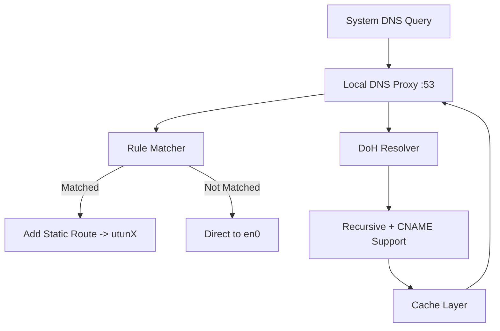

# OpenVPNAdvanced (English Documentation)

> A rule-based OpenVPN traffic splitter supporting DoH DNS proxy, rule subscriptions, dynamic route injection, DNS caching, and more.

---
[中文文档](https://github.com/iaaaannn0/openvpnadvanced/blob/main/README_CN.md)

## 📚 Table of Contents

- [Project Overview](#project-overview)
- [Features](#features)
- [Getting Started](#getting-started)
  - [Prerequisites](#prerequisites)
  - [Build & Installation](#build--installation)
  - [Start the Service](#start-the-service)
  - [Configure Local DNS](#configure-local-dns)
- [Configuration Guide](#configuration-guide)
- [How It Works](#how-it-works)
- [Architecture](#architecture)
- [Module Description](#module-description)
- [FAQ](#faq)
- [Performance Optimization](#performance-optimization)
- [Security & Privacy](#security--privacy)
- [How to Verify VPN Routing](#how-to-verify-vpn-routing)
- [Developer Guide](#developer-guide)
- [License](#license)

---

## Project Overview

This project is designed to provide OpenVPN users with a high-performance and flexible rule-based traffic splitter. It prevents all traffic from going through VPN and supports subscriptions, DNS caching, CNAME resolution, and DNS pollution protection.

---

## Features

- ✅ Local DNS proxy (supports DoH / TCP / UDP)
- ✅ Custom rules and remote subscriptions (auto deduplication & merge)
- ✅ Accurate routing (adds static route via utunX)
- ✅ Automatic VPN interface detection (e.g. utun0 / utun8)
- ✅ Fixes default macOS gateway to direct network interface
- ✅ Supports recursive CNAME resolution
- ✅ Ultra-fast response via cache
- ✅ One-command startup, no complex setup

---

## Getting Started

### Prerequisites

- Go 1.18+
- macOS (supports `route`, `scutil`, etc.)
- Connected OpenVPN client (e.g. Tunnelblick)

### Build & Installation

```bash
git clone https://github.com/iaaaannn0/openvpnadvanced.git
cd openvpnadvanced
go build -o openvpnadvanced ./cmd
```

### Start the Service

```bash
sudo ./openvpnadvanced
```

### Interactive Console

The tool provides an interactive command console (ovpnctl) for runtime control.

#### Start the Console

```bash
sudo ./openvpnadvanced --start
```

Then type:

```text
ovpnctl> help
```

#### Common Commands

| Command | Description |
|---------|-------------|
| `start` | Start the core logic silently in the background, logs written to file |
| `startv` | Start and show real-time logs in console |
| `status` | Check if core is running and OpenVPN check status |
| `view-log info` | Show all logs |
| `view-log err` | Show only error logs |
| `view-log vpn` | Show only VPN route logs |
| `test example.com` | Test if the domain matches VPN rule |
| `rtest example.com` | Resolve and determine if VPN or direct |
| `show-iface` | Display current VPN interface info |
| `clear` | Clear console screen |
| `reload-config` | Reload config.ini without restarting service |
| `check-openvpn-on/off` | Enable/disable OpenVPN client check |
| `log-on/off` | Turn logging on or off |
| `set-log-level info/vpn/err` | Set log verbosity |
| `clear-log` | Clear all log files |
| `exit` | Exit the console |

> Tab-completion supported. Navigate input history with arrow keys.

---

### Configure Local DNS

```bash
sudo networksetup -setdnsservers Wi-Fi 127.0.0.1
```

### Test Example

```bash
dig youtube.com +short
go run tools/trace.go youtube.com
```

---

## Configuration Guide

- `assets/rule.list`: Custom rule list
- `assets/subscriptions.txt`: Online subscription sources
- `assets/merged_rule.list`: Merged rule file (auto-generated)
- `output/vpn_ips.txt`: IPs routed through VPN (log output)
- `assets/cache.json`: Cached DNS records (auto-generated)

Supported formats:
```
DOMAIN-SUFFIX,google.com
DOMAIN,facebook.com
```

---

## How It Works

This tool implements fine-grained domain-based traffic routing through a local DNS proxy.

### 1. System DNS Redirection

Set your system's DNS to `127.0.0.1` and let the tool capture all DNS queries via TCP/UDP 53.

### 2. Rule Matching & Caching

- Checks the local cache first
- If cache misses, domain is matched against `merged_rule.list` (supports `DOMAIN-SUFFIX`, `DOMAIN`, etc.)

### 3. DoH & CNAME Resolution

If no match or no cache, fallback to DoH (Cloudflare or Google):
- Recursively resolve A, AAAA, and CNAME records
- Fallback on intermediate CNAMEs to ensure final IP

### 4. Route Control

Based on matching result:
- ✅ Matched: `route add` to VPN interface (e.g. utun8)
- ❌ Not matched: default direct route (e.g. en0)

Removes catch-all routes (`0.0.0.0/1`, `128.0.0.0/1`) and restores default gateway at startup.

### 5. Debug Tool

Use `tools/trace.go` to:
- Show if domain matched
- Display IP result
- Show VPN or direct
- Print CNAME hops

---

## Architecture



---

## Module Description

| Module | Path | Description |
|--------|------|-------------|
| main.go | `cmd/` | Program entry |
| config.go | `config/` | Config loader |
| doh.go | `doh/` | DoH resolver |
| server.go | `dnsproxy/` | DNS proxy server |
| fetcher.go / parser.go | `fetcher/` | Subscription fetcher |
| openvpn.go | `vpn/` | VPN interface & route logic |
| trace.go | `tools/` | Domain debug tool |

---

## FAQ

### Q1: "No VPN interface found"

Make sure your VPN is active and utunX exists (`ifconfig`).

### Q2: `route: not in table` warning?

Catch-all route already removed. Safe to ignore.

### Q3: Domain unreachable (e.g. `ted.com`)?

Caused by deep CNAME chains. Recursive resolution is supported.

### Q4: Reset system DNS?

```bash
sudo networksetup -setdnsservers Wi-Fi empty
```

---

## Performance Optimization

- **DNS Caching**: Results saved in `assets/cache.json`
- **Selective Routing**: Only matched IPs are routed
- **CNAME Optimization**: Uses fallback and cache
- **Subscription Deduplication**: Merges and dedupes rules

---

## Security & Privacy

- All DNS queries use encrypted DoH
- No telemetry or user tracking
- Cache is local and can be deleted

---

## How to Verify VPN Routing

### Manually via CLI

```bash
dig youtube.com +short
# -> 64.233.162.91

route -n get 64.233.162.91
```

If output shows:

```
interface: utun8
```

It is routed through VPN.

### Using Trace Tool

```bash
go run tools/trace.go youtube.com
```

Output will show:

```
Route via: utun8
✅ This domain is routed through VPN
```

---

## Developer Guide

```bash
# Run main logic
sudo go run cmd/main.go

# Test rule match for domain
go run tools/trace.go example.com
```

### Project Structure

```text
.
├── cmd/                 # Program entry
├── config/              # Config reader
├── dnsmasq/             # Resolver & cache
├── doh/                 # DoH client
├── dnsproxy/            # DNS listener
├── fetcher/             # Rule subscription
├── vpn/                 # VPN logic
├── tools/               # Debug tools
├── assets/              # Rules & cache
└── output/              # VPN logs
```

---

## License

MIT License © 2025

Permission is hereby granted, free of charge, to any person obtaining a copy...
