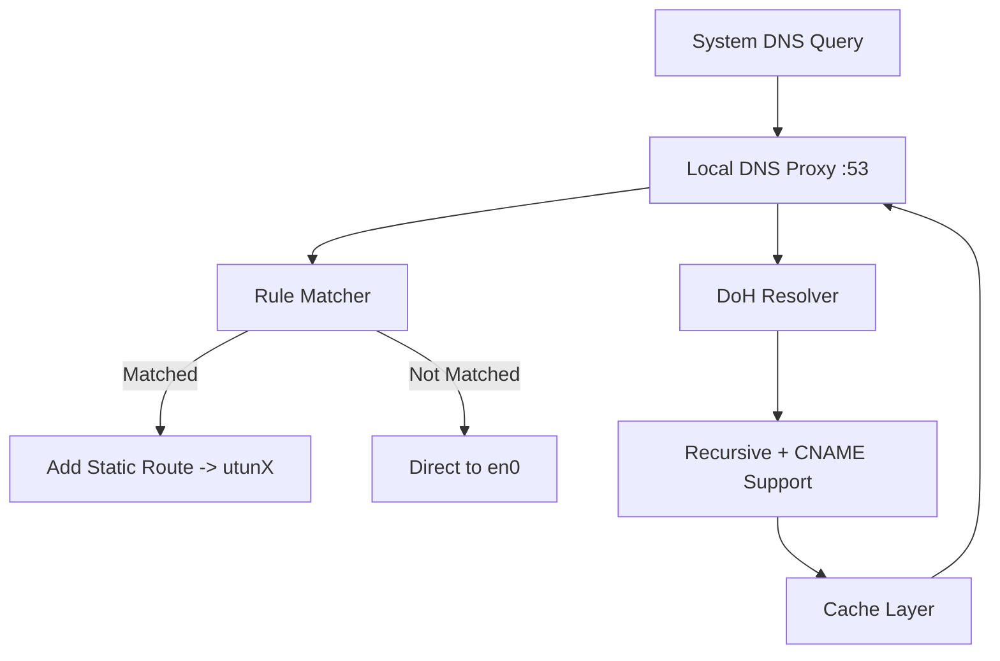

# OpenVPNAdvanced

> A rule-based traffic splitter for OpenVPN, supporting DoH DNS proxy, rule subscriptions, dynamic routing, caching, and more.

---
[中文文档](https://github.com/iaaaannn0/openvpnadvanced/blob/main/README_CN.md)


## 📚 Table of Contents

- [Introduction](#introduction)
- [Features](#features)
- [Usage Guide](#usage-guide)
  - [Prerequisites](#prerequisites)
  - [Build & Install](#build--install)
  - [Start Service](#start-service)
  - [Configure Local DNS](#configure-local-dns)
- [Rule Configuration](#rule-configuration)
- [How It Works](#how-it-works)
- [System Architecture](#system-architecture)
- [Module Overview](#module-overview)
- [FAQ](#faq)
- [Performance Optimization](#performance-optimization)
- [Security & Privacy](#security--privacy)
- [Verify VPN Routing](#verify-vpn-routing)
- [Developer Guide](#developer-guide)
  - [Key Function References](#key-function-references)
- [License](#license)

---

## Introduction

OpenVPNAdvanced is designed to provide OpenVPN users with a high-performance, flexible rule-based traffic splitter. It prevents all traffic from going through VPN and supports rule subscriptions, DNS caching, CNAME resolution, DNS protection, and more.

---

## Features

- ✅ Local DNS Proxy (support DoH / TCP / UDP)
- ✅ Custom rule list and remote subscriptions (auto-merge & deduplicate)
- ✅ Accurate routing (static route via utunX)
- ✅ Automatically detect VPN interface (e.g., utun0 / utun8)
- ✅ Fix macOS default gateway to direct interface
- ✅ Full CNAME recursive resolution
- ✅ Instant response via cache hits
- ✅ One-command setup

---

## Usage Guide

### Prerequisites

- Go 1.18+
- macOS with OpenVPN client (e.g. Tunnelblick)
- Active VPN connection

### Build & Install

```bash
git clone https://github.com/iaaaannn0/openvpnadvanced.git
cd openvpnadvanced
go build -o openvpnadvanced ./cmd
```

### Start Service

```bash
sudo ./openvpnadvanced
```

### Configure Local DNS

```bash
sudo networksetup -setdnsservers Wi-Fi 127.0.0.1
```

### Test Example

```bash
dig youtube.com +short
go run tools/trace.go youtube.com
```

---

## Rule Configuration

- `assets/rule.list`: Custom rules
- `assets/subscriptions.txt`: Online rule subscriptions
- `assets/merged_rule.list`: Auto-generated merged rules
- `output/vpn_ips.txt`: Logged IPs routed via VPN
- `assets/cache.json`: DNS cache

Supported formats:
```
DOMAIN-SUFFIX,google.com
DOMAIN,facebook.com
```

---

## How It Works

The program achieves domain-based traffic splitting through a local DNS proxy.

### 1. DNS Redirection

Set system DNS to `127.0.0.1` to redirect all queries to local TCP/UDP 53 proxy.

### 2. Rule Matching & Cache

- Cache is checked first
- If not cached, domain is matched against `merged_rule.list`

### 3. DoH Resolution with CNAME

- Uses Cloudflare / Google DoH
- Recursively resolves A/AAAA/CNAME chain
- Falls back to A/AAAA on intermediate CNAMEs for real IP

### 4. Route Management

- ✅ Matched: Adds static route to `utunX` via `route add`
- ❌ Not matched: Leaves route untouched (default interface like `en0`)

Removes VPN catch-all routes (`0.0.0.0/1`, `128.0.0.0/1`) and restores actual default gateway at startup.

### 5. Trace Tool

Use `tools/trace.go` to:

- Print resolution result
- Show rule match
- Indicate VPN route or direct
- Display CNAME chain

---

## System Architecture



---

## Module Overview

| Module | Path | Description |
|--------|------|-------------|
| main.go | `cmd/` | Program entry |
| config.go | `config/` | Load config |
| doh.go | `doh/` | DoH logic |
| server.go | `dnsproxy/` | DNS server |
| fetcher.go / parser.go | `fetcher/` | Rule fetching |
| openvpn.go | `vpn/` | VPN routing logic |
| trace.go | `tools/` | Debug CLI tool |

---

## FAQ

### Q1: "No VPN interface found"

Make sure VPN is connected and `utunX` exists (check via `ifconfig`).

### Q2: `route: not in table`

Catch-all route already removed, safe to ignore.

### Q3: Some domains inaccessible (e.g. `ted.com`)

Likely due to deep CNAME chains. Latest version supports recursive resolution.

### Q4: Restore DNS?

```bash
sudo networksetup -setdnsservers Wi-Fi empty
```

---

## Performance Optimization

- **DNS Caching**: Results stored in `assets/cache.json`
- **Selective Routing**: Only adds matched IPs
- **CNAME Optimization**: Uses cache and fallback logic
- **Rule Deduplication**: Merges local & remote rules

---

## Security & Privacy

- DoH ensures encrypted DNS queries
- No telemetry, no logging
- Cache is local and can be removed manually

---

## Verify VPN Routing

### CLI Method

```bash
dig youtube.com +short
# -> 64.233.162.91

route -n get 64.233.162.91
```

If output shows:

```
interface: utun8
```

It is routed via VPN.

### Trace Tool

```bash
go run tools/trace.go youtube.com
```

Sample:

```
Route via: utun8
✅ This domain is routed through VPN
```

---

## Developer Guide

```bash
# Run main service
sudo go run cmd/main.go

# Debug a domain
go run tools/trace.go example.com
```

### Project Structure

```text
.
├── cmd/                 # Entry point
├── config/              # Config loader
├── dnsmasq/             # Resolver & cache
├── doh/                 # DoH client
├── dnsproxy/            # DNS listener
├── fetcher/             # Rule fetchers
├── vpn/                 # VPN control
├── tools/               # Trace utility
├── assets/              # Rule & cache files
└── output/              # VPN IP logs
```

---

## Key Function References

### dnsmasq/

- `ResolveRecursive()`: Full DNS resolve w/ CNAME
- `ResolveWithCNAME()`: Same + first CNAME shown
- `MatchesRules()`: Rule match logic

### doh/

- `Query() / QueryA() / QueryAAAA()`: A/AAAA resolver
- `QueryWithCNAME()`: A + CNAME combo
- `QueryAll()`: All DNS records

### dnsproxy/

- `StartDNSProxy()`: Launch local proxy

### vpn/

- `DetectVPNInterface()`: Get utun interface
- `AddRoute()`: Route IP via VPN
- `CorrectDefaultRoute()`: Fix macOS gateway

### fetcher/

- `LoadRulesFromFile()`: Load local rules
- `LoadSubscriptions()`: Fetch remote
- `MergeRules()`: Merge and dedup

### trace.go

- `main()`: CLI for resolution debug
- Uses `ResolveWithCNAME()`

> All functions are documented and IDE-friendly.

---

## License

MIT License © 2025
