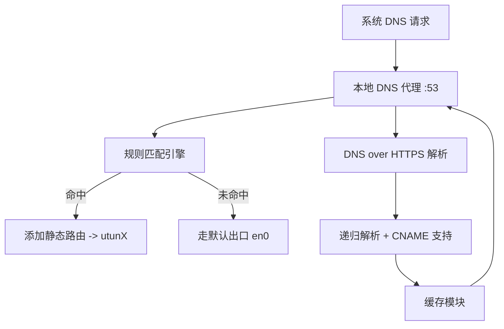

# OpenVPNAdvanced 中文说明文档

> 一个基于规则的 OpenVPN 流量分流器，支持 DoH DNS 代理、规则订阅、动态添加路由、缓存加速等。

---

## 📚 目录

- [项目简介](#项目简介)
- [功能特性](#功能特性)
- [使用教程](#使用教程)
  - [前置依赖](#前置依赖)
  - [安装构建](#安装构建)
  - [启动服务](#启动服务)
  - [设置本地 DNS](#设置本地-dns)
- [配置说明](#配置说明)
- [程序实现原理](#程序实现原理)
- [系统架构设计](#系统架构设计)
- [模块说明](#模块说明)
- [常见问题与解决方案](#常见问题与解决方案)
- [性能优化说明](#性能优化说明)
- [安全与隐私](#安全与隐私)
- [如何验证是否真的走 VPN](#如何验证是否真的走-vpn)
- [开发者指南](#开发者指南)
- [许可证](#许可证)

---

## 项目简介

本项目旨在为 OpenVPN 用户提供一个高性能、灵活的规则分流工具，避免全部流量走 VPN，支持中英规则订阅、缓存、CNAME 解析、防 DNS 污染等。

---

## 功能特性

- ✅ 本地 DNS 代理（支持 DoH / TCP / UDP）
- ✅ 自定义规则与规则订阅（自动去重合并）
- ✅ 精准分流（添加静态路由走 utunX）
- ✅ 自动识别 VPN 接口（如 utun0 / utun8）
- ✅ 修复 macOS 默认路由为直连网卡
- ✅ 支持 CNAME 多级跳转解析
- ✅ 命中缓存即返回，超快响应
- ✅ 一键启动，无需繁琐配置

---

## 使用教程

### 前置依赖

- Go 1.18+
- macOS 系统（支持 `route`、`scutil` 等命令）
- 已连接的 OpenVPN 客户端（如 Tunnelblick）

### 安装构建

```bash
git clone https://github.com/iaaaannn0/openvpnadvanced.git
cd openvpnadvanced
go build -o openvpnadvanced ./cmd
```

### 启动服务

```bash
sudo ./openvpnadvanced
```

### 设置本地 DNS

```bash
sudo networksetup -setdnsservers Wi-Fi 127.0.0.1
```

### 测试效果

```bash
dig youtube.com +short
go run tools/trace.go youtube.com
```

---

## 配置说明

- `assets/rule.list`: 自定义分流规则
- `assets/subscriptions.txt`: 在线规则订阅源
- `assets/merged_rule.list`: 合并后的规则（自动生成）
- `output/vpn_ips.txt`: 所有被分流的 IP（日志输出）
- `assets/cache.json`: DNS 缓存记录（自动生成）

规则格式支持：
```text
DOMAIN-SUFFIX,google.com
DOMAIN,facebook.com
```

---

## 程序实现原理

本程序通过本地 DNS 代理服务实现精细化域名分流，其工作原理分为以下几个阶段：

### 1. 系统 DNS 重定向

用户将系统的 DNS 设置为 `127.0.0.1`，由本程序监听本地 53 端口（TCP/UDP），拦截所有 DNS 请求。

### 2. 规则匹配与缓存查询

收到 DNS 请求后，程序会：
- 查询本地缓存，如已存在解析结果则直接返回
- 否则进入规则判断流程，根据域名匹配 `merged_rule.list` 中的规则（支持 `DOMAIN-SUFFIX`、`DOMAIN` 等）

### 3. DoH 解析与 CNAME 跟踪

若命中规则或缓存未命中，则使用 Cloudflare / Google DoH 服务进行解析：
- 递归支持 A、AAAA、CNAME 跳转链，直到获得真实 IP 地址
- 对每一个跳转中间节点都尝试 A/AAAA fallback，确保拿到最终 IP

### 4. 路由控制

根据是否命中规则：
- ✅ 命中：调用 `route add` 指令，将目标 IP 加入路由表，并指定走 utun 接口（如 utun8）
- ❌ 未命中：不修改系统路由，默认走直连出口（如 en0）

同时，为避免 OpenVPN 捕获全局流量，程序在启动时自动清除 `0.0.0.0/1` 和 `128.0.0.0/1` 等 catch-all 路由，并重建真实默认网关。

### 5. 调试工具 trace.go

提供 `tools/trace.go` 工具，可模拟域名解析流程，输出：
- 命中规则状态
- 当前 IP
- 是否通过 VPN 接口路由
- CNAME 跳转链

---

## 系统架构设计



---

## 模块说明

| 模块 | 路径 | 功能说明 |
|------|------|----------|
| main.go | `cmd/` | 程序主入口 |
| config.go | `config/` | 配置加载 |
| doh.go | `doh/` | DoH 解析实现 |
| server.go | `dnsproxy/` | DNS 代理监听 |
| fetcher.go / parser.go | `fetcher/` | 订阅拉取与规则解析 |
| openvpn.go | `vpn/` | VPN 接口识别、路由设置 |
| trace.go | `tools/` | 调试用 trace 工具 |

---

## 常见问题与解决方案

### Q1: 启动时提示 "No VPN interface found"
- 请确保你已连接 VPN，使用 `ifconfig` 查看是否存在 utun 接口

### Q2: `route: not in table` 报错
- 说明默认路由已被移除，无需处理

### Q3: 某些域名无法访问（如 `ted.com`）
- 可能是 CNAME 解析未递归到底，程序已支持递归处理，请确保使用最新版

### Q4: 如何还原 DNS 设置？

```bash
sudo networksetup -setdnsservers Wi-Fi empty
```

---

## 性能优化说明

为了确保高效稳定运行，本程序进行了以下优化设计：

- **DNS 缓存机制**：所有解析结果将缓存至 `assets/cache.json`，避免重复解析、减少 DoH 请求。
- **按需添加路由**：仅对命中规则的目标 IP 添加静态路由，避免污染全局路由表。
- **递归解析优化**：在解析 CNAME 链时，优先使用缓存命中，未命中才递归进行 DoH 查询。
- **订阅规则去重**：自动合并与去重本地和远程规则，提升匹配效率。

---

## 安全与隐私

我们重视用户数据的私密性：

- 所有 DNS 查询均使用加密的 DNS-over-HTTPS（DoH）协议完成，防止明文泄漏。
- 本地仅缓存 IP 结果，**不记录访问来源与用户信息**。
- 用户可随时手动清除 `assets/cache.json` 来移除 DNS 历史记录。

---

## 如何验证是否真的走 VPN

你可以使用如下命令手动确认目标 IP 是否通过 VPN 接口：

```bash
# 示例：检查 youtube.com 是否通过 utun8
dig youtube.com +short
# 假设返回 64.233.162.91

route -n get 64.233.162.91
```

如果输出包含如下字段：

```
interface: utun8
```

则说明该域名的访问流量已成功被路由至 VPN 接口。

也可以使用程序自带工具：

```bash
go run tools/trace.go youtube.com
```

输出将显示：

```
Route via: utun8
✅ This domain is routed through VPN
```

---

## 开发者指南

```bash
# 运行主程序
sudo go run cmd/main.go

# 调试 DNS 路由行为
go run tools/trace.go example.com
```

### 项目结构

```text
.
├── cmd/                 # 主程序入口
├── config/              # 配置读取
├── dnsmasq/             # DNS 解析和缓存
├── doh/                 # DoH 逻辑
├── dnsproxy/            # DNS 服务监听
├── fetcher/             # 订阅和规则拉取
├── vpn/                 # VPN 相关接口/路由
├── tools/               # 调试工具
├── assets/              # 配置文件和缓存
└── output/              # 路由记录输出
```

---

## 关键函数说明

以下为项目中各核心模块的关键函数简要说明：

#### dnsmasq/

- `ResolveRecursive(domain string, rules []Rule, cache *Cache)`: 递归解析域名（含 CNAME 支持），返回是否命中规则及 IP。
- `ResolveWithCNAME(domain string, rules []Rule, cache *Cache)`: 与上类似，但额外返回首个 CNAME 跳转名，用于 trace 视图。
- `MatchesRules(domain string, rules []Rule)`: 判断域名是否匹配规则集。

#### doh/

- `Query(domain string)`: 执行 A 记录查询。
- `QueryAAAA(domain string)`: 执行 AAAA 记录查询（IPv6）。
- `QueryWithCNAME(domain string)`: 返回 A + CNAME（若存在）信息。
- `QueryAll(domain string)`: 返回所有记录（A、AAAA、CNAME）。

#### dnsproxy/

- `StartDNSProxy(...)`: 启动本地 DNS 服务，监听 TCP/UDP :53 端口，内部调用上层解析逻辑。

#### vpn/

- `DetectVPNInterface()`: 自动识别当前系统的 utun 接口名称。
- `AddRoute(ip, iface string)`: 将指定 IP 添加路由表中并指向指定 VPN 接口。
- `CorrectDefaultRoute()`: 修复默认网关为直连网卡，并移除 VPN catch-all 路由。

#### fetcher/

- `LoadRulesFromFile(path string)`: 加载本地规则列表。
- `LoadSubscriptions()`: 从订阅地址下载远程规则。
- `MergeRules(...)`: 去重合并规则，写入 merged_rule.list。

#### tools/trace.go

- `main()`: 命令行工具，用于调试 DNS 分流效果。
- 内部调用 `ResolveWithCNAME()` 并打印是否命中规则、路由出口等调试信息。

> 所有函数都有详细注释，支持在 IDE 中跳转查阅具体实现。

---

## 许可证

本项目使用 [MIT License](https://opensource.org/licenses/MIT) 开源许可协议。

```
MIT License

Copyright (c) 2025

Permission is hereby granted, free of charge, to any person obtaining a copy...
```

---

欢迎 Star⭐、提 Issue、提 PR，一起完善这个强大实用的 VPN 分流工具！
